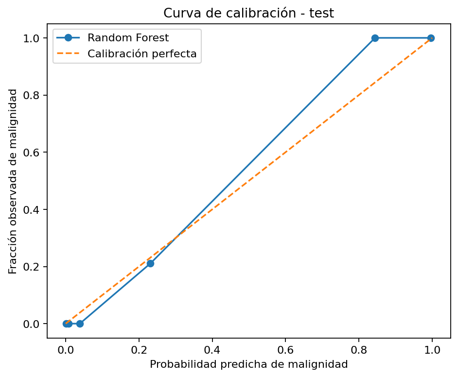

# Breast Cancer API — MLOps end-to-end

Servicio de inferencia para un **Random Forest** entrenado con Breast Cancer Wisconsin Diagnostic. El proyecto cubre entrenamiento reproducible, validación, serialización, contrato REST, Docker, pruebas automáticas, smoke tests y publicación en GHCR.

> **Proyecto demostrativo de portafolio.** No es un dispositivo médico ni debe utilizarse para diagnóstico o toma de decisiones clínicas.

## Vista rápida

- **Modelo:** RandomForestClassifier, versión **1.0.0**.
- **Dataset:** Breast Cancer Wisconsin Diagnostic, 569 observaciones y 30 features.
- **Clase positiva:** malignant = 1; benign = 0.
- **Test:** Accuracy **0.9649**, F1 **0.9512**, ROC-AUC **0.9974**, PR-AUC **0.9957**.
- **Calibración:** Brier score **0.0285** y curva de confiabilidad.
- **API:** validación estricta de 30 features, tipos, finitud, rangos y batch.
- **Docker:** usuario no-root, Gunicorn y HEALTHCHECK.
- **CI/CD:** entrenamiento → pytest/JUnit → Docker build → smoke tests → GHCR.
- **Trazabilidad:** model_card.json, versión, commit de entrenamiento y SHA-256 del artefacto.

## Arquitectura

~~~text
Breast Cancer Wisconsin
        |
        v
src/api/training.py
        |
        +-- GridSearchCV + StratifiedKFold
        +-- métricas test/CV
        +-- Brier + reliability plot
        |
        v
artifacts/model.pkl
artifacts/model_card.json
artifacts/calibration_curve.png
        |
        v
Flask API -- Gunicorn -- Docker
        |
        v
pytest -> Docker smoke test -> GHCR
~~~

## Modelo y evaluación

El target original de scikit-learn usa 0=malignant y 1=benign. Para evitar ambigüedad en producción, el entrenamiento remapea explícitamente:

- **0 = benign**
- **1 = malignant**

El split es **80/20 estratificado**, con random_state=42. El Random Forest se selecciona con GridSearchCV y StratifiedKFold(5), optimizando ROC-AUC.

### Hiperparámetros seleccionados

~~~text
max_depth=8
max_features=sqrt
min_samples_leaf=2
n_estimators=400
class_weight=balanced
~~~

### Métricas finales en test

| Métrica | Resultado |
|---|---:|
| Accuracy | **0.9649** |
| Precision — malignant | **0.9750** |
| Recall — malignant | **0.9286** |
| F1 — malignant | **0.9512** |
| ROC-AUC | **0.9974** |
| PR-AUC | **0.9957** |
| Brier score ↓ | **0.0285** |

### Validación cruzada — 5 folds

| Métrica | Media | Desv. estándar |
|---|---:|---:|
| Accuracy | 0.9582 | 0.0162 |
| Precision | 0.9470 | 0.0212 |
| Recall | 0.9412 | 0.0322 |
| F1 | 0.9438 | 0.0223 |
| ROC-AUC | 0.9890 | 0.0056 |

El Brier score y la curva siguiente evalúan la calidad probabilística. **No se aplica recalibración**; el gráfico se usa como diagnóstico.

La metadata completa está en [artifacts/model_card.json](artifacts/model_card.json), incluyendo dataset, versión, SHA-256, features, rangos de entrenamiento, métricas y limitaciones.

## API REST

| Método | Ruta | Propósito |
|---|---|---|
| GET | / | Metadatos mínimos del servicio |
| GET | /api/health | Estado y versión del modelo cargado |
| GET | /api/schema | Contrato de las 30 features y rangos |
| POST | /api/predict | Predicción por una o más instancias |

### Contrato de POST /api/predict

Reglas de validación:

- instances debe ser un array con **1 a 100** elementos;
- cada instancia debe ser un objeto JSON;
- deben estar presentes **exactamente las 30 features**;
- no se permiten features extra;
- todos los valores deben ser numéricos y finitos;
- cada valor debe estar dentro del rango observado durante entrenamiento;
- esos rangos describen el **dominio del modelo**, no límites clínicos.

### Features y rangos de entrenamiento

| Feature | Tipo | Min | Max |
|---|---|---:|---:|
| mean radius | number | 6.981 | 28.11 |
| mean texture | number | 9.71 | 39.28 |
| mean perimeter | number | 43.79 | 188.5 |
| mean area | number | 143.5 | 2501.0 |
| mean smoothness | number | 0.06251 | 0.1634 |
| mean compactness | number | 0.01938 | 0.3454 |
| mean concavity | number | 0.0 | 0.4268 |
| mean concave points | number | 0.0 | 0.2012 |
| mean symmetry | number | 0.106 | 0.304 |
| mean fractal dimension | number | 0.05024 | 0.09744 |
| radius error | number | 0.1115 | 2.873 |
| texture error | number | 0.3602 | 4.885 |
| perimeter error | number | 0.757 | 21.98 |
| area error | number | 6.802 | 542.2 |
| smoothness error | number | 0.001713 | 0.03113 |
| compactness error | number | 0.002252 | 0.1064 |
| concavity error | number | 0.0 | 0.396 |
| concave points error | number | 0.0 | 0.05279 |
| symmetry error | number | 0.007882 | 0.07895 |
| fractal dimension error | number | 0.0008948 | 0.02984 |
| worst radius | number | 7.93 | 36.04 |
| worst texture | number | 12.02 | 49.54 |
| worst perimeter | number | 50.41 | 251.2 |
| worst area | number | 185.2 | 4254.0 |
| worst smoothness | number | 0.07117 | 0.2226 |
| worst compactness | number | 0.02729 | 1.058 |
| worst concavity | number | 0.0 | 1.252 |
| worst concave points | number | 0.0 | 0.291 |
| worst symmetry | number | 0.1565 | 0.6638 |
| worst fractal dimension | number | 0.05504 | 0.2075 |

La fuente programática del contrato es GET /api/schema.

### Ejemplo curl listo para copiar

~~~bash
curl --fail-with-body -X POST http://localhost:8080/api/predict \
  -H "Content-Type: application/json" \
  -d '{
    "instances": [{
      "mean radius": 17.99,
      "mean texture": 10.38,
      "mean perimeter": 122.8,
      "mean area": 1001.0,
      "mean smoothness": 0.1184,
      "mean compactness": 0.2776,
      "mean concavity": 0.3001,
      "mean concave points": 0.1471,
      "mean symmetry": 0.2419,
      "mean fractal dimension": 0.07871,
      "radius error": 1.095,
      "texture error": 0.9053,
      "perimeter error": 8.589,
      "area error": 153.4,
      "smoothness error": 0.006399,
      "compactness error": 0.04904,
      "concavity error": 0.05373,
      "concave points error": 0.01587,
      "symmetry error": 0.03003,
      "fractal dimension error": 0.006193,
      "worst radius": 25.38,
      "worst texture": 17.33,
      "worst perimeter": 184.6,
      "worst area": 2019.0,
      "worst smoothness": 0.1622,
      "worst compactness": 0.6656,
      "worst concavity": 0.7119,
      "worst concave points": 0.2654,
      "worst symmetry": 0.4601,
      "worst fractal dimension": 0.1189
    }]
  }'
~~~

### Estructura de respuesta

~~~json
{
  "model_version": "1.0.0",
  "results": [
    {
      "prediction": 1,
      "label": "malignant",
      "malignant_probability": 0.93,
      "probabilities": {
        "benign": 0.07,
        "malignant": 0.93
      }
    }
  ]
}
~~~

Los números anteriores son **ilustrativos del formato**. La API devuelve las probabilidades del artefacto cargado.

### Errores de contrato

| Código | Uso |
|---:|---|
| 400 | JSON mal formado/no interpretable |
| 415 | Content-Type distinto de application/json |
| 422 | features faltantes/extra, tipo/rango o batch inválido |
| 503 | artefacto del modelo no disponible |
| 500 | error interno inesperado |

Los errores del cliente no se convierten en 500, y el servidor no expone mensajes internos en fallas inesperadas.

## Entrenamiento y trazabilidad

~~~bash
python -m src.api.training
~~~

El entrenamiento genera:

~~~text
artifacts/
├── model.pkl
├── model_card.json
└── calibration_curve.png
~~~

model_card.json registra versión, dataset, definición de clases, split, semilla, hiperparámetros, métricas CV/test, Brier, features/rangos, commit, SHA-256 del artefacto, entorno y limitaciones.

La imagen Docker se etiqueta con **latest**, **SHA del commit** y **v1.0.0**, vinculando servicio y versión de modelo.

## Docker

~~~bash
docker build -t breast-cancer-api:local .
docker run --rm -p 8080:8080 breast-cancer-api:local
curl --fail http://localhost:8080/api/health
~~~

Mejoras aplicadas:

- versiones fijadas en requirements.txt;
- pip sin cache;
- cache de capas de dependencias;
- **usuario no-root**;
- **Gunicorn** en lugar del servidor de desarrollo Flask;
- HEALTHCHECK;
- .dockerignore.

## Tests y CI/CD

El workflow .github/workflows/ci.yml usa gates explícitos:

~~~text
train + pytest
      |
      +-- JUnit report
      +-- model.pkl
      +-- model_card.json
      +-- calibration_curve.png
      |
      v
Docker build
      |
      v
container smoke test
  +-- GET /api/health
  +-- POST /api/predict
      |
      v
push a GHCR (solo main)
~~~

En pull requests se conservan como artefactos el reporte JUnit, artefactos del modelo y logs del smoke test. La publicación a GHCR ocurre **solo después** de tests Python y smoke tests del contenedor.

~~~text
ghcr.io/koke-oliva/breast_cancer_api:latest
ghcr.io/koke-oliva/breast_cancer_api:v1.0.0
~~~

## Reproducibilidad local

~~~bash
git clone https://github.com/Koke-Oliva/breast_cancer_api.git
cd breast_cancer_api

python -m venv .venv

# Linux/macOS
source .venv/bin/activate

# Windows PowerShell
# .venv\Scripts\Activate.ps1

pip install -r requirements.txt
python -m src.api.training
pytest -q
gunicorn --bind 0.0.0.0:8080 "src.main:create_app()"
~~~

## Estructura

~~~text
.
├── .github/workflows/ci.yml
├── artifacts/
│   ├── calibration_curve.png
│   ├── model.pkl
│   └── model_card.json
├── src/
│   ├── api/
│   │   ├── model.py
│   │   ├── routes.py
│   │   └── training.py
│   ├── tests/
│   │   ├── fixtures/predict_valid.json
│   │   ├── conftest.py
│   │   ├── test_api.py
│   │   └── test_model.py
│   └── main.py
├── .dockerignore
├── .gitignore
├── Dockerfile
├── requirements.txt
└── README.md
~~~

## Limitaciones y próximos pasos

- La evaluación es interna; falta validación externa y temporal.
- El dataset de 569 casos no representa una población clínica general.
- Los rangos de entrada son límites del dominio observado, no valores de referencia médica.
- La calibración se evalúa, pero el modelo no está recalibrado.
- No hay autenticación, TLS, rate limiting ni observabilidad distribuida.
- Un sistema real exigiría seguridad, privacidad, gobernanza, monitoreo de drift y supervisión clínica.

## Contexto académico

Proyecto desarrollado inicialmente para el **Módulo 10 — Implementación y Despliegue de Modelos de Aprendizaje** de la Especialización en Machine Learning de IT Academy / Kibernum.

La versión profesionalizada conserva el objetivo original —modelo serializado, API Flask, Docker y CI/CD— y añade validación de contrato, métricas reproducibles, calibración, trazabilidad, pruebas de endpoints, smoke testing y documentación orientada a revisión técnica.
